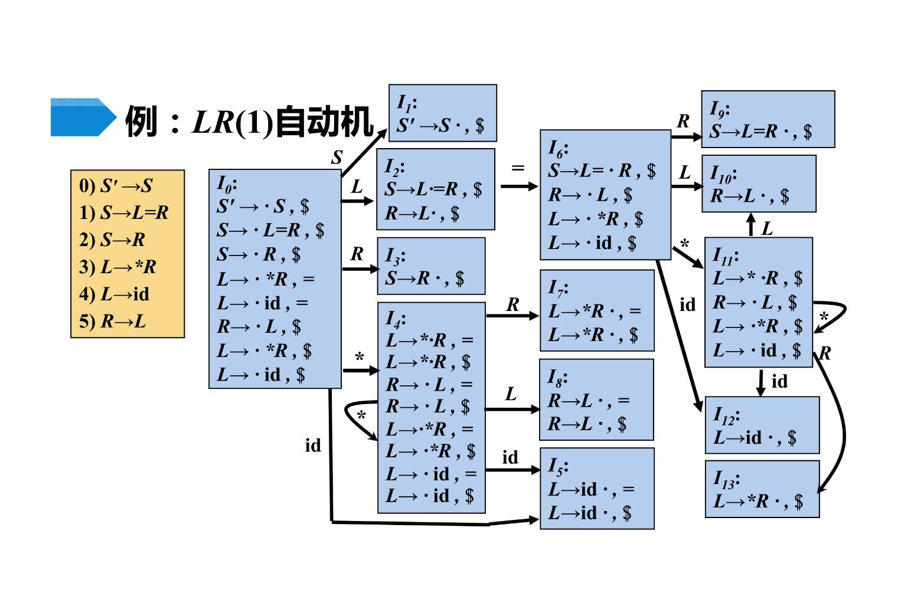
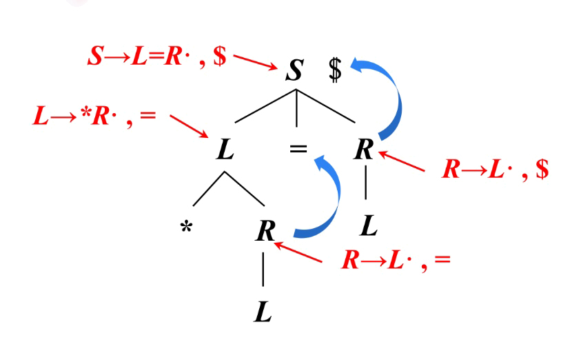
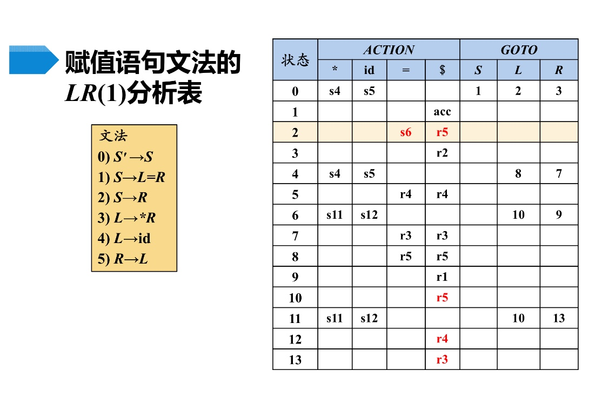

## LR 分析法与构造 LR(1) 分析表的步骤 - 例题解析

直接做题是有一些特定步骤，有技巧。但也必须先了解一些基本概念，本篇会通过例题形式解释概念，会容易理解和记忆，以及解决类似问题。

如果只想做题可以直接下拉至习题部分。

#### （一）关于状态

对于产生式 A→aBcD，就可以分解为下面几个不同的识别状态：

> （1）A→.aBcD
> （2）A→a.BcD
> （3）A→aB.cD
> （4）A→aBc.D
> （5）A→aBcD.

**“.” 的左部符号表示已被识别出来的那部分句柄符号**

状态（1）表示：处于句柄的头
状态（2）表示：已经识别出字符 a，**等待** 形成以 B 为产生式左部的右部
状态（3）表示：刚刚进行了一次规约，即把关于 B 的产生式右部规约成 B
状态（4）表示：已经识别出字符 c，**等待** 形成以 D 为产生式左部的右部
状态（5）表示：已经到达句柄的尾巴，可以把 aBcD 规约为产生式左部的符号 A

#### （二）什么是 LR(k) 分析法？

字面意思理解：

| 字符 | 含义                                                         |
| ---- | ------------------------------------------------------------ |
| L    | 表示 **从左到右** 扫描输入串                                 |
| R    | 表示利用 **最右分析方法** 来识别句子，即构造一个 **最右推导的逆过程** |
| k    | 表示向右查看输入串符号的个数                                 |

LR 分析过程是规范归约的过程

规范规约是最右推导的逆过程，最右推导是规范推导，所以 **最左规约是规范规约。**

LR 分析法根据当前分析栈中的符号串和向右顺序查看输入串的 k 个符号就可以唯一确定分析器的动作是移进还是归约、利用那个产生式进行归约。

当没有指明 k 是几的时候，默认为 1

#### （三）文法的拓广？

文法的拓广是对现有文法，添加一个 S'，并对文法进行展开。

**例如：**

> 对于文法 G[E]:
> E → E+T|T
> T → T*F|F
> F → i|(E)

可以把它拓广为

> 文法 G[E']:
> E' → E
> E → E+T|T
> T → T*F|F
> F → i|(E)

**此时可能会有疑问，不就是加了个开始符号，有什么意义呢？为什么要再加个开始符号呢？**

加开始符号是为了状态的表示，这样原来的 S 会成为右部，可以表示 .S 和 S.

**那同一非终结符的右部有多种情况为什么不展开呢？**

这里是说拓广文法，是添加开始符号，可以展开可以不展开，但是一般默认要展开，一般一道题不会只让求拓广文法，而是为了后面。一般题目中是说 “**求该文法的拓广文法并编号**”，此时请一定要展开。展开后应该是这样：

> 1.E'→E
> 2.E → E+T
> 3.E → T
> 4.T → T*F
> 5.T → F
> 6.F → i
> 7.F → (E)

#### （四）什么是项目？项目有哪些分类？等价状态？

上面提到拓广文法，展开，以及编号。

**先看例题：**

> 对于文法 G[S]:
> S → vI:T
> I → I,i
> I → i
> T → r

**可以把它拓广并编号，如下：**

> 文法 G[S']:
> 1.S' → S
> 2.S → vI:T
> 3.I → I,i
> 4.I → i
> 5.T → r

**它的全部 LR(0) 项目，如下：**

> 1.S' → .S
> 2.S' → S.
> 3.S → .vI:T
> 4.S → v.I:T
> 5.S → vI.:T
> 6.S → vI:.T
> 7.S → vI:T.
> 8.I → .I,i
> 9.I → I.,i
> 10.I → I,.i
> 11.I → I,i.
> 12.I → .i
> 13.I → i.
> 14.T → .r
> 15.T → r.

**对上面 LR(0) 项目进行分类**

| 类型     | 包含                | 特点                                                   |
| -------- | ------------------- | ------------------------------------------------------ |
| 规约项目 | 2, 7, 11, 13, 15    | . 在右部的末尾                                         |
| 接收项目 | 2                   | . 在开始符号的末尾                                     |
| 移进项目 | 3, 5, 9, 10, 12, 14 | . 后面跟着终结符，表移进                               |
| 待约项目 | 1, 4, 6, 8          | . 后面跟着非终结符，表等待后面非终结符的规约，简称待约 |

**谁和谁是等价状态？**

**例如：**

待约项目 4 即 S→v.I:T 它的含义是等待栈顶规约出 I，但尚未识别对应 I 的那些句柄的任何符号；

项目 8 即 I→.I,i 和项目 12 即 I→.i 的含义也是期待栈顶形成 I 的句柄，所以这三个项目的含义是一样的，即 4, 8, 12 三个状态是等价的。

同理：项目 6 即 S → vI:.T 和项目 14 即 T → .r 也是等价的

**为什么它们是等价状态？怎么判断等价状态？**

上面有说因为他们表示的含义是一样的，并且会发现等价肯定涉及至少一个待约项目，以及一个 . 在最左端的移进项目。

这是因为，待约项目是 . 后面跟非终结符，这个 . 是在非终结符的前面；当存在该非终结符的产生式时，且 . 在最左端的时候。因为 . 在最左端，其实也是相当于在该非终结符的前面。所以是一个等价的状态。

#### （五）LR 分析表介绍

> **LR 分析器的关键部分是 分析表的构造。分析表有以下几种：**

**规范的 LR 分析表：**

- LR(0)，能力最弱，局限性较大，但理论上最重要。
- LR(1)，它功能最强，但代价也最大。

**简单的 LR 分析表：**

- 简称 SLR ，最容易实现，但功能最弱。

**向前看的 LR 分析表：**

- 简称 LALR，功能和代价处于前两者之间，适用于绝大多数程序语言的文法

**总结：** LR(0) 功能最弱，功能弱是说当文法中产生式比较复杂，出现某些问题时，无法解决。这些问题一部分可以由 SLR 分析法解决。但还有一部分 SLR 解决不了，可以用 LR(1) 来解决。

#### （六）关于 “**展望**”

在规范归约过程中，一方面记住已移进和归约出的整个符号串，即记住 “**历史**”，另一方面根据所用的产生式推测未来可能碰到的输入符号，即对未来进行 “**展望**”。

当一串貌似句柄的符号串呈现于分析栈的顶端时，根据所记载的 “历史” 和 “展望” 材料，来确定栈顶的符号串是否构成句柄。

**为了记住分析的 “历史” 和汇集 “展望” 的信息，LR 分析法这样处理：**

> **将归约过程的 “历史” 和 “展望” 材料综合抽象成某些状态，存放在一个状态栈中，栈中每个状态都概括了从分析开始直到某一归约阶段的全部“历史”和“展望”材料。**

**LR(1) 分析法这样处理：**

首先，明白了在 LR(1) 分析法中展望是为了解决其他分析法解决不了的问题。简单的说就是，状态会出现冲突，我们不能只通过后 1 个输入串符号，直接确定选用哪个产生式，这是严重的错误。

所以 **展望（向前搜索符）** 是通过展望后面的内容，所以展望对应的终结符，应该 **属于该非终结符的 FOLLOW 集（确切的说，属于 FOLLOW 集中的具体哪个个终结符，应该根据产生式的推导过程确定，通过语法树来分析，是比较直观的方法。也可以直接通过求该非终结符后的 FIRST 集来确定，但要注意是对谁求 FIRST 集，可表示为 FIRST(βa)，例题中会提到）**，来帮助唯一确定选择产生式。

> **拓展注：这里提到的 FOLLOW 集和 FIRST 集不是冲突的，因为我们要求的向前搜索符时 FOLLOW 集的子集，有时候不能确定，所以用 FIRST(βa)， β 表示由谁哪个非终结符推导的，这个非终结符的后面的剩余串，a 表示它上一个状态中的向前搜索符。它俩拼接起来的串，对该串求 FIRST 集。
> 那么可能会有疑问，利用上一个状态？那第一个状态呢？第一个状态是固定的 S'→S,#
> 其实 # 就是 S 的 FOLLOW 集中的唯一的元素，它也是开始符号的向前搜索符
> 所以说 FOLLOW 集和 FIRST(βa) 是都可以求的，FIRST(βa) 是准确的向前搜索符，它是 FOLLOW 集的一部分**

在 LR(1) 中，用

> **状态, 终结符**
> 例如：S' → # （#表示开始符号FOLLOW集会提到那个符号，有的地方用 $，是一样的 ）

这种形式是表式展望，终结符就是展望的后面的终结符，具体的下面例题中还会提到。

#### （七）终极例题 - LR(1) 分析表的构造

**给定文法 G[S]：**

> **S→L=R | R
> L→\*R | id
> R→L**

**回答以下问题：**

（1）文法的拓广并编号
（2）LR(1) 项目集规范族所对应的识别活前缀的 DFA
（3）构造 LR(1) 分析表

**解析：**

##### 1）文法的拓广并编号：

拓广文法 G[S']：

> **（0）S'→S
> （1）S→L=R
> （2）S→R
> （3）L→\*R
> （4）L→id
> （5）R→L**

##### 2）LR(1) 项目集规范族所对应的识别活前缀的 DFA*

这里就涉及到 “展望” 这个知识点了

**向前搜索符的 FIRST 集求法：**

求法 FIRST(βa)

- β 表示由谁哪个非终结符推导的，这个非终结符的后面的剩余串
- a 表示它上一个状态中的向前搜索符。

对于 I0 ：
首先 S' → .S, # 这个是固定的，就是第一个状态的核心项目
下面对 S 求向前所有符都没问题，都是 #
到了 L→.*R，这里，求向前搜索符，使用 FIRST(βa)
应该是求 FIRST(=R#) 所以就是 = 了

**为什么是 =R#?**

因为 β 表示由谁哪个非终结符推导的，这里就是上面状态【S→.L=R, #】这个非终结符 L 的后面的剩余串是 =R，a 表示它上一个状态中的向前搜索符，就是 #，拼接起来就是 =R#。

（图片来源：中国大学慕课 -《编译原理》哈尔滨工业大学 陈老师）

**该 DFA 有穷自动机的解释：**

（1）这样表示形式就是自动机，每个方框表示一个状态，从 I0 到 I13 所以共有 14 个状态。
（2）每个状态中包含的多个项目，都是等价的。
（3）每个项目中逗号后面的终结符或者 # 表示展望的终结符。
（4）关于画出 DFA 的步骤：

- 以 I0 为例，首先对于 0 号产生式 S' → S，可知应该有 S' → .S 和 S' → S. 两个状态，因为 S' 是开始符号，展望是属于 FOLLOW 集的，展望应该是 #，可以得出 S' → .S, #
- 因为 .S 表示等待规约出 S 的状态。并且 S→L=R，所以 .S 和 .L=R 是两个等价的状态。但需要注意的是此时的 FOLLOW 集应该 S 的 FOLLOW 集，而不是 L 的，也不 R 的
- 同理，因为有 S→R，则 .S 和 .R 是两个等价的状态。
- 有了 .R，应该继续去找 R 为左部的产生式，因为有 R→L，所以 .S 和 .L 是两个等价的状态。
- **注意：** 在找 R 的展望终结符时，**展望** 是通过展望后面的内容，所以展望对应的终结符，应该 **属于该非终结符的 FOLLOW 集（确切的说，属于 FOLLOW 集中的具体哪个个终结符，应该根据产生式的推导过程确定，通过语法树来分析，是最直观的方法）**

（图片来源：中国大学慕课 -《编译原理》哈尔滨工业大学 陈老师）

可以看出来 R 的展望应该有两种情况，一个是 =，一种是 #

**但此时，我们通过 S → R 找到的 R，所以应该是 #**

不断循环通过，将 . 后移，判断下一个状态，找出等价状态，直到判断完成。

##### 3）构造 LR(1) 分析表

根据自动机即可构造 LL(1) 分析表：

（图片来源：中国大学慕课 -《编译原理》哈尔滨工业大学 陈老师）

**LL(1) 分析表解释补充：**

（1）内容 LL(1) 分析表 = 动作表 (ACTION) + 状态转移表(GOTO)

（2）**动作表** 中的每一个元素 ACTION[S,a] 规定了当 **栈顶状态** 为 S，且面临输入符号 a 时应采取的动作。根据自动机中的终结符边可判断。

（3）**状态转换表** 中的每一个元素 GOTO[S,x] 规定了当状态 S 面对文法符号位 x 时的下一个状态。根据自动机中的非终结符边可判断。

（4）**动作表** 的列对应所有终结符加上 #

（5）**状态转换表** 的列对应所有非终结符，不包括 S'，因为 S 就是开始符号，S' 是为了使 “**接收状态**” 易于识别，所引入的。

（6）**动作表** 中例如：

- ACTION[0, *] 的 **S4 表示移进，入栈，就是当前状态为 0，当输入串为 \*，则将状态 4 移进状态栈，将 \* 移进文法符号栈**
- ACTION[5, =] 的 **r4 表示符合产生式 4，将栈顶符号 id 规约为产生式左部**
- acc 表示接收

（7）**状态转换表** 中例如：

- GOTO[0, S] 的 **数字为 1 表示转入 1 状态，置当前文法符号栈顶为 S，栈顶状态为 1**

（8）**构造 LL(1) 分析表的步骤，重要 ！！！：**

- **确定对应行** ，行就是所有状态
- **确定对应列** ，列有两部分 ACTION 表和 GOTO 表，**ACTION 表中列是所有终结符，以及 #。 GOTO 表的对是所有非终结符，不包括 S'**
- **!!!GOTO 表的构造：判断当前输入串，如果存在自动机的边，且边为非终结符就把状态编号填入 GOTO 表**
- **!!!ACTION 表的构造：**
  - **查找该状态中是否有 . 在最后的状态，如果有先根据向前搜索符确定哪一列，再用 rn，填入表示，r 的含义是规约，n 表示的是产生式的序号；如果没有则说明没有没有 r**
  - **判断是否存在该状态输出的边，如果存在则用 Sn 表示，S 表示移进，入栈，n 表示下一个状态的序号**

（9）上面也更深入的了解了展望的意义，首先，**展望是存在一个状态中的，终结符，对应的应该为是当前等价的状态，操作也就应该是移进。如果是自动机的边，就是说不是当前状态了，所以对应的是规约。**

------

##### 总结

**易错点：**

- 求 **展望对应的终结符** 是通过展望后面的内容，所以展望对应的终结符，应该 **属于该非终结符的 FOLLOW 集（确切的说，属于 FOLLOW 集中的具体哪个个终结符，应该根据产生式的推导过程确定，通过语法树来分析，是最直观的方法）**
- 各教材描述可能存在差异，但思想是相同的
  - 比如 $ 和 #
  - 比如展望终结的表示方法，有的分开写，有的直接用或