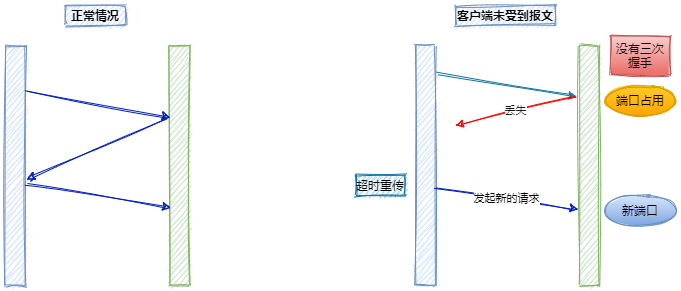
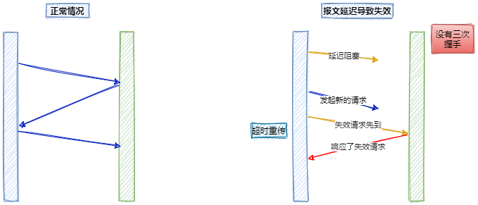
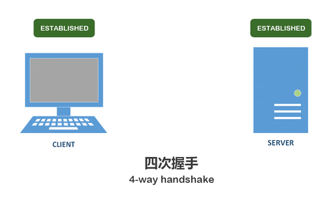

# 三次握手，四次挥手

我们都知道TCP是面向连接的，`三次握手`就是用来建立连接的，`四次握手`就是用来断开连接的。

# 三次握手

先上图：

我们来看一下三次握手的过程：

- 一开始，客户端和服务端都处于 `CLOSED` 状态。客户端主动打开连接，服务端被动打卡连接，结束`CLOSED` z状态，开始监听，进入 `LISTEN`状态。

**一次握手**

- 客户端会随机初始化序号（`client_isn`），将此序号置于 TCP 首部的「序号」字段中，同时把 `SYN` 标志位置为 `1` ，表示 `SYN` 报文。接着把第一个 SYN 报文发送给服务端，表示向服务端发起连接，该报文不包含应用层数据，之后客户端处于 `SYN-SENT` 状态。

**二次握手**

- 服务端收到客户端的 `SYN` 报文后，首先服务端也随机初始化自己的序号（`server_isn`），将此序号填入 TCP 首部的「序号」字段中，其次把 TCP 首部的「确认应答号」字段填入 `client_isn + 1`, 接着把 `SYN` 和 `ACK` 标志位置为 `1`。最后把该报文发给客户端，该报文也不包含应用层数据，之后服务端处于 `SYN-RCVD` 状态。

**三次握手**

- 客户端收到服务端报文后，还要向服务端回应最后一个应答报文，首先该应答报文 TCP 首部 `ACK` 标志位置为 `1` ，其次「确认应答号」字段填入 `server_isn + 1` ，最后把报文发送给服务端，这次报文可以携带客户到服务器的数据，之后客户端处于 `ESTABLISHED` 状态。

好了，经过三次握手的过程，客户端和服务端之间的确定连接正常，接下来进入`ESTABLISHED`状态，服务端和客户端就可以快乐地通信了。

这里有个动态过程的图示：

这里有个小细节，第三次握手是可以携带数据的，这是面试常问的点。

> **那么为什么要三次握手呢？两次不行吗？**

- 为了防止服务器端开启一些无用的连接增加服务器开销
- 防止已失效的连接请求报文段突然又传送到了服务端，因而产生错误。

由于网络传输是有延时的(要通过网络光纤和各种中间代理服务器)，在传输的过程中，比如客户端发起了 SYN=1 的第一次握手。

如果服务器端就直接创建了这个连接并返回包含 SYN、ACK 和 Seq 等内容的数据包给客户端，这个数据包因为网络传输的原因丢失了，丢失之后客户端就一直没有接收到服务器返回的数据包。

如果没有第三次握手告诉服务器端客户端收的到服务器端传输的数据的话，服务器端是不知道客户端有没有接收到服务器端返回的信息的。服务端就认为这个连接是可用的，端口就一直开着，等到客户端因超时重新发出请求时，服务器就会重新开启一个端口连接。

这样一来，就会有很多无效的连接端口白白地开着，导致资源的浪费。

这个过程可理解为：

还有一种情况是已经失效的客户端发出的请求信息，由于某种原因传输到了服务器端，服务器端以为是客户端发出的有效请求，接收后产生错误。

所以我们需要“第三次握手”来确认这个过程：

通过第三次握手的数据告诉服务端，客户端有没有收到服务器“第二次握手”时传过去的数据，以及这个连接的序号是不是有效的。若发送的这个数据是“`收到且没有问题`”的信息，接收后服务器就正常建立 TCP 连接，否则建立 TCP 连接失败，服务器关闭连接端口。由此减少服务器开销和接收到失效请求发生的错误。

# 四次挥手

还是先上图：

聚散终有时，TCP 断开连接是通过**四次挥手**方式。

`双方`都可以主动断开连接，断开连接后主机中的「资源」将被释放。

上图是客户端主动关闭连接 ：

**一次挥手**

- 客户端打算关闭连接，此时会发送一个 TCP 首部 `FIN` 标志位被置为 `1` 的报文，也即 `FIN` 报文，之后客户端进入 `FIN_WAIT_1` 状态。

**二次挥手**

- 服务端收到该报文后，就向客户端发送 `ACK` 应答报文，接着服务端进入 `CLOSED_WAIT` 状态。

**三次挥手**

- 客户端收到服务端的 `ACK` 应答报文后，之后进入 `FIN_WAIT_2` 状态。等待服务端处理完数据后，也向客户端发送 `FIN` 报文，之后服务端进入 `LAST_ACK` 状态。

**四次挥手**

- 客户端收到服务端的 `FIN` 报文后，回一个 `ACK` 应答报文，之后进入 `TIME_WAIT` 状态
- 服务器收到了 `ACK` 应答报文后，就进入了 `CLOSED` 状态，至此服务端已经完成连接的关闭。
- 客户端在经过 `2MSL` 一段时间后，自动进入 `CLOSED` 状态，至此客户端也完成连接的关闭。

你可以看到，每个方向都需要**一个 FIN 和一个 ACK**，因此通常被称为**四次挥手**。

> **为什么要挥手四次？**

再来回顾下四次挥手双方发 `FIN` 包的过程，就能理解为什么需要四次了。

- 关闭连接时，客户端向服务端发送 `FIN` 时，仅仅表示客户端不再发送数据了但是还能接收数据。
- 服务器收到客户端的 `FIN` 报文时，先回一个 `ACK` 应答报文，而服务端可能还有数据需要处理和发送，等服务端不再发送数据时，才发送 `FIN` 报文给客户端来表示同意现在关闭连接。

从上面过程可知，服务端通常需要等待完成数据的发送和处理，所以服务端的 `ACK` 和 `FIN` 一般都会分开发送，从而比三次握手导致多了一次。

> **为什么客户端在TIME-WAIT阶段要等2MSL？**

为的是确认服务器端是否收到客户端发出的 ACK 确认报文，当客户端发出最后的 ACK 确认报文时，并不能确定服务器端能够收到该段报文。

所以客户端在发送完 ACK 确认报文之后，会设置一个时长为 2MSL 的计时器。

MSL 指的是 Maximum Segment Lifetime：一段 TCP 报文在传输过程中的最大生命周期。

2MSL 即是服务器端发出为 FIN 报文和客户端发出的 ACK 确认报文所能保持有效的最大时长。

服务器端在 1MSL 内没有收到客户端发出的 ACK 确认报文，就会再次向客户端发出 FIN 报文：

- 如果客户端在 2MSL 内，再次收到了来自服务器端的 FIN 报文，说明服务器端由于各种原因没有接收到客户端发出的 ACK 确认报文。

客户端再次向服务器端发出 ACK 确认报文，计时器重置，重新开始 2MSL 的计时。

- 否则客户端在 2MSL 内没有再次收到来自服务器端的 FIN 报文，说明服务器端正常接收了 ACK 确认报文，客户端可以进入 CLOSED 阶段，完成“四次挥手”。

所以，客户端要经历时长为 2SML 的 TIME-WAIT 阶段;这也是为什么客户端比服务器端晚进入 CLOSED 阶段的原因。

这里同样有个动态过程的图示：

好了，我们的文章到这就……