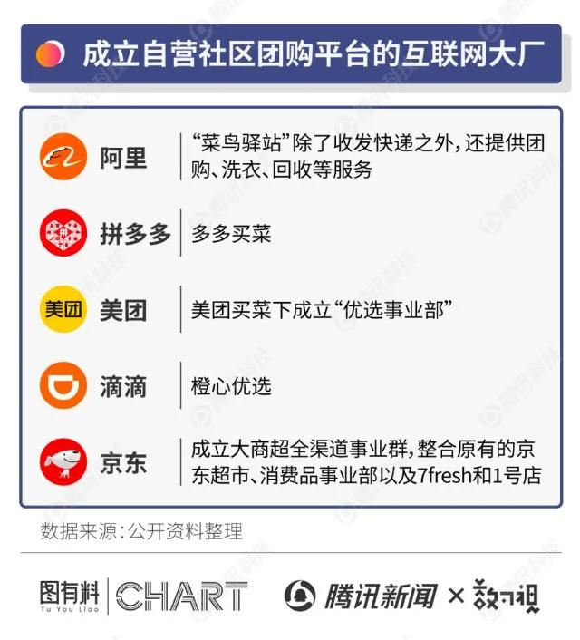

# 兴盛优选杀出血路，腾讯投下垄断反对票

这本来该是一场闪电战。

2020年10月28日，晚上10点多，供应商老王焦急地在“长沙美团优选”群里喊话，“采购出来主持一下工作，看看接下来我们供应商要怎么搞，怎么干。”

这个群刚刚成立不到一个小时，里面只有供应商和美团优选的采购人员，供应商们都在争抢着上车，哪怕被压价，也要挤上这个机会。

但他们还是慢了一步，早在前一天，“多多买菜”的拓展人员就已经空降长沙，没有任何招聘的过程，直接从江西空运来BD，开始快速争夺市场，而更早之前，滴滴旗下的“橙心优选”早就开始大规模招聘，每天有上百号人冲进长沙的面试现场。

这是在无数新兴行业反复上演过的故事，外卖、共享单车、网约车...每当一个风口出现，巨头们就带着热钱涌入，**撒最狠的补贴，烧最多的钱，快速耗死对手圈下市场。**

作为新兴风口，又可以深度切入本地生活服务场景的社区团购，自然成了巨头们觊觎的肥肉。

本来，继续沿着这条路径发展下去，这个市场也会很快用财力决出高下，然后陷入垄断的樊笼。但现在，这一切并没有发生。

其实早在2018年下半年，社区团购就被争抢过一次，最疯狂的时候，3个月内超过20亿资金涌入，远超共享单车和无人货架的吸金能力。

那是一场恶战，早先赛道上头部的几家几乎全部倒下，松鼠拼拼资金链断裂，你我您和十荟团为了保命不得不合并，呆萝卜则一步迈向倒闭。

最早开启这条赛道的兴盛优选，是那轮大逃杀的幸存者，也是这一次，巨头们汇聚长沙的狩猎对象。

如今几个月过去，巨头们再难寸进，而发源于农村的兴盛优选，熬过了来势汹汹的围剿，进一步壮大。2021年2月19日，这家公司完成最新一轮融资，30亿美元，拥有了行业内最大的融资规模，估值高达80亿美元。

**在兴盛优选背后，另一股资本力量悄然汇聚，在巨头之间竖起反垄断的旗帜。**

兴盛优选成为行业反垄断的突破口，和这家公司的基因有关。

2016年，长沙覆盖率最高的便利店品牌芙蓉兴盛涉足社区团购，以便利店作为自提点，两万多家湖南本土的店铺，构成整个兴盛优选系统的基本盘，也是难以撼动的城墙。

实际上，社区团购的逻辑并不复杂：平台提供货源、供应链、技术、品牌、营销等支持，“团长”利用在线下真实社区的影响力组织团购，消费者下单后，平台将商品统一配送至小区交给团长，再由团长负责组织取货，交易达成后团长依据交易额获得提成。

这相当于把批发市场直接搬到用户家门口。从这个逻辑讲，社区团购只不过是对传统经销渠道乃至于整个产业链的升级重构。这也是所谓的社区团“鼻祖”兴盛优选，选择以实体门店作为发展基点的原因。

**这个动作，对于店主们意义重大。**

自从网购普及以后，实体店的生存状况越发严峻。2013年，随着冲击扩散，国内零售业黑马永辉超市关闭5家门店，成都春熙路街头屹立20年的太平洋百货骤然歇业，曾经熙来攘往的北京市新街口南大街、西四南大街、东直门南小街，临街商铺大批量关停。

与此同时，新兴的网购增速却一路狂飙，超过实体店20%。

芙蓉兴盛创始人岳立华算了笔账，发现无论城市还是乡村，“未来有可能70%的商品都是通过线上来购买的，线下购买的可能是一些比如说水、槟榔、烟，还有盐之类的东西”。

换句话说，依靠芙蓉兴盛门店维生的店主们，很可能会被这股浪潮吞没。发家于农村的芙蓉兴盛，早期店主几乎都由乡土亲族、地缘等关系发展而来，岳立华和他的芙蓉兴盛，必须要保住这些人的生计，**这也是保住自身赖以生存的根。**

转型求生，迫在眉睫。

岳立华试图借鉴团购、网购的模式，去构建一种线上线下结合，用网购为实体店吸引客流，又通过实体店为网购拓宽客源的新业态，社区团购这种模式的雏形，开始萌发。

兴盛优选构建系统的过程，按照他们内部的说法，被分为四个阶段。最早的门店自配送模式因为履约成本太高失败，后来以重资建仓储为核心的网仓模式、配送站模式，也无法跑通盈利模型，举步维艰。

到2016年，兴盛优选亏损几千万，团队濒临解散，只有几个核心技术人员和创始人岳立华、周颖洁、刘辉宇留了下来。周颖洁和刘辉宇回归到最底层，花费大半年时间整天和门店泡在一起，收货卖货，以店员的身份了解门店的痛点、需求。

门店老板的诉求并不复杂：不希望投入额外的人力和资金；不想囤货；希望能即刻收款；希望增加店内客流，“这件事让我花钱的时候肯定不干”。

基于这些诉求，兴盛优选摸索出预售自提模式：顾客在App端下单，大仓统一根据订单采购，再分发到门店让顾客自取。这种模式不需要参与的团长们自有库存，节约了物流和人力成本，**又可以实现向门店导流的目的。**

新模式投入试验后，由于App里那些门店本身并不具备的生鲜、水果等商品，不会跟门店形成竞争，又可以带来明显的人气，店主们很快开始主动加入。短短一年，新模式复制推行到62家门店，订单从每天2000单攀升至20000单。

除了探索出明确的盈利路径，这套模式还有一个好处——灵活。

在生意繁忙的城市地区，店主可以选择让客人上门自提，为门店带来流量；而客流量稀少、老人为主的偏僻地区，夫妻小卖部的店主们，则可以靠送货上门获得顾客的青睐，获得稳定的长期收入。

位于湖南省常德市，桃园县边上的八房坪村，整个村子的消费需求都依靠着一间叫“福初商店”的夫妻小店。

整个村子的在籍居民有八百多人，但实际上常住人口远没那么多，除开村小里现有的四十多个孩子，剩下的几乎都是留守老人。

以前村子里不是这样的，站在自家小卖部门口，店主康福初抬起左手，指着小河边比划起来，“二十多年前，这里一条路上就有三家小卖部，生意都特别好”。那时候，村子里年轻人还很多，白天种完地，傍晚时候大家就聚在小卖部门口，打牌的打牌，喝酒的喝酒。

后来那三家小卖部无声无息地消失了，村子里的人要买包盐都必须走一两个多小时，到镇子上去。再后来，康福初炸鱼的时候炸断了右手，没法像身边同样年纪的伙伴一样进城务工，只好和妻子开起现在这家小商店。

这家整个八房坪村唯一的商店活在缝隙里，每个月的利润最多几百块钱，堪堪能够维持生计。**当社区团购进入这个农村，什么都变了。**

**凋敝乡村的复苏**

早晨十点，康福初从驾驶座下面抽出一块木条，卡住车子左前轮，把车停在山坡的小路上。

十公斤的大米，只靠左手攥住，康福初走得有些摇晃。听到喇叭声，屋里的老人早已拉开铁门，一个五六岁的孩子躲在门后，探着头打量这个每天都来送东西的人。

这是康福初加入兴盛优选的第二年，村子里的人早已经习惯通过手机购买食物、生活用品，除了个别老人会打电话让儿女下单，更多的还是直接叫康福初帮忙代买。

把大米放到桌上，康福初接过老人递来的水喝了一口，又回到车上准备前往下一家，今天的订单总共有三页，估计需要一两个小时才能送完。订单上的商品琳琅满目，从猪肉、玉米、活鱼，再到童车、玩具、取暖器，**日常生活的方方面面购物需求，几乎都被涵盖在内。**

康福初说，今天的生意不那么理想，只有115件商品，远远不如才开始做社区团购的时候，最高峰一天能有280多单，从早忙到晚，感觉东西“送都送不完”。有时候实在赶时间，和买家约定一个村子里的地点，或是某座桥头，或是田垄的一处交汇，康福初匆匆忙忙放下东西，就要奔赴下一处。

2019年3月，镇子上的朋友把他拉进一个兴盛优选的团购群，康福初发现在群里买东西，比自己去进货都要便宜，随即动了加入社区团购的念头。

兴盛优选对于团长的准入门槛一直严格把控，要求团长有门店，有人脉，如果业绩不达标，还会被取消点位。康福初最初的几次申请，都因为门店位置过于偏远遭拒，后来兴盛优选派人上门考察，看见康福初的实际状况，帮忙协调了附近的仓储站点，他才总算成功入行。

由于缺乏经验，康福初损失了一辆助力车。那天也是爆单的日子，康福初手忙脚乱，把车子随手停到坡道上，拿着货就闷头狂奔，结果送完货回头一看，车子已经滑进小河里。没来得及心疼，新的单子已经到来，康福初赶忙买下辆二手助力车，又花两千块钱换了块电池，继续忙活。

风扇、冰箱、床垫、电视，大件小件，都从他这里经过，**不足八平米的小店扮演着外界商品进入这个村子的桥头堡，串联起里外两个世界。**

康福初找出以前经手过的单子，说现在村子里很多户都换了新的家电，印象最深的一次，有个孩子给父母买了台五十多寸的大电视，搬起来挺沉，这一单，他赚了有七十多。

社区团购在村子里普及之前，年轻人表达孝心的方式只有给钱，老人拿着钱舍不得花，也没地方花，最多就是打打牌，在牌桌上你来我往。社区团购出现后，远在省外的年轻人只需要动动手指，康福初就能送货上门，家具家电还能帮忙安装。

2000年，农村消费总规模为1.5万亿元，到2013年提升到4.66万亿元，13年间增长3.1倍，越过这一年，全国居民消费升级综合指数一路走高，消费升级的脚步越发加快。兴盛优选内部针对农村市场的消费需求做过调查，发现如今农村的消费水平没有想象那么低，“许多农村的女性的消费者们，他们用化妆品的话，也希望用千把块钱左右的化妆品”。

对下沉市场的消费升级现象，腾讯投资部门也曾做过研究，认为最终中国的大部分城市会达到像现在三四线甚至二线城市的水平。过程中，高线城市的生活方式，包括消费习惯、品牌选择，会对低线城市以及农村地区进行逐渐渗透。

而网络电商，无疑会加速这一区域化消费差异的拉近，这个过程里，既有渠道成熟带来的整合机会，也有伴随渠道发展诞生的供应链机会。

**支撑起这些变化的，是一套无形、庞大的系统。**

截至2020年6月，中国网民规模达9.4亿，较2020年3月增长3625万，相当于全球网民的1/5；手机网民规模达9.32亿，占比超99%。互联网普及率达67%，较3月提升2.5个百分点，约高于全球平均水平5个百分点。

随着网络覆盖工程的深入，我国城乡数字鸿沟显著缩小，城乡渗透效应明显：同样以2020年6月的数据为例，农村地区互联网普及率为52.3%，较3月提升6.1个百分点，城乡地区互联网普及率差异为24.1%，2017年以来首次缩小到30%以内。

脱胎于互联网的社区团购等新兴业态，在这股浪潮下不断改造着中国农村。同样被社区团购改变了购物方式的，还有娄底市的天华村。

以天华村村委会、桃花垄等点为中心，一公里内有二十多个团长。天华村下辖24个村民小组，全村1128户，人口3167人，假设一个团长可以向一个百人群提供服务，那按照天华村团长的数量，至少可以向2000户人家提供服务，是天华村实际户口数量的2倍。

原来在电商平台下单一件商品，天华村村民只能到五公里外的镇中心取，自从有了社区团购，他们只需要提前一天在微信群下单，次日即可送到村民家门口的自提点。

而这种深度介入乡村购物场景，并且针对乡村设计供应链的模式，又反过来加固了兴盛优选的城墙——在整个行业的头部里，兴盛优选的履约成本最低，仅3%。

湖南县域间的乡间小道，拦住了习惯快速搭建物流通道的巨头们，而兴盛优选的团长，肩挑手扛，渗透进技术短期内无法触达的隐秘角落。

在城市里，维系社区团购的是效率和平台的履约率，但在农村，**要让这种商业模式可以顺利运转，更重要的是彼此熟悉的人际关系和朴素的温情。**

也正是基于这种独特的生态，社区团购巨头们冲入湖南分割市场的时候，整个天华村只有兴盛优选一家。即使“多多和美团的人已经来找过我们”，依然没有人愿意打破这种基于乡村人情社会，由邻里、亲缘关系催生的一致行动的默契。

**在湖南市场围猎兴盛优选失败，是社区团购赛道上巨头们的滑铁卢，也是这个行业回归正常的契机。**

垄断带来的恶果，最近的货拉拉事件就是例证。当一家企业占据难以撼动的市场优势地位，不再需要依靠自律和自我更新维护消费者，傲慢和懈怠就会成为这家企业的底色。除非出现重大过失或影响恶劣的公共事件，否则期待这样的企业自我纠错、顾虑消费者的体验，难如登天。

这也是国家推出九不得新规，限制社区团购行业无序竞争的原因，实际上，如果这个行业形成垄断会发生什么，在长沙之战最白热化的时候，已经显露出了端倪。

2020年11月，橙心优选、美团优选、多多买菜，几乎同步正式开启进攻湖南长沙市场的步伐，长沙的实体经济顷刻遭受剧烈冲击。

长沙街头，菜市场里冷清萧条，看着人流量一天比一天少，摊主们枯坐在各自的摊位上，无可奈何。长沙市芙蓉区，才翻新过不久的今朝星市集菜市场，一整个上午只有一位顾客到来，在蔬菜摊挑选完蔬菜后又离去，**水产和肉类摊位的老板无事可做，在摊前睡起了觉。**

规模大一些的曙光农贸市场，同样没有什么人气。一位年近六旬的女摊主忧心忡忡，散客都去网上买菜了，餐馆也不会从她这里进货，每个月一千多的摊位费根本赚不出来，“我年纪大了，别的也不会做，只能先干着。”

菜市场里的摊主抱怨不断，认为投靠社区团购的便利店抢走了属于他们的生意，但实际上，便利店的日子也不好过。

长沙八一路，全长不过两公里的街道上，打开任何一家社区团购的小程序，都能看到密密麻麻的自提点。无论便利店、打印店、鲜花店、宾馆，还是餐馆、理发店，都成为美团、滴滴、拼多多、兴盛优选等企业的附庸。店主们身兼多个平台的团长，负责将平台商品分发至用户手中。

经营便利店的王芬，同时也担任着滴滴、美团和兴盛优选的团长。虽然便利店紧邻街道，但依然顾客稀少。王芬认为自己的生意被社区团购抢走了，但她自己又不得不加入其中”本来线下也没什么生意，来自提的用户到店里来，店里的东西都比线上贵。”

湖南本地连锁便利店品牌新佳宜在门店张贴扫码领券的海报，旁边的美宜佳便利店直接将优惠商品堆放在门口吸引用户，不远处，已经有一家小超市交不出库房租金，被社区居委会限期搬离。

挖团长、圈物流、撒补贴，这场以长沙为中心的巨头乱战，快速辐射向整个湖南。

“醉翁之意不在酒”的互联网巨头，从一开始就偏离了兴盛优选的模式。他们拼命补贴烧钱，抢的是通往社区最后一公里的渠道，只要占领渠道，**就可以轻易输出自己所控制与支配的商品，甚至因此具有定价权。**

饿了么、美团、滴滴、还有暴雷的蛋壳公寓，刚开始都是靠这套模式突出重围的。现在点外卖和线上打车相比前几年贵了多少，大家心里都有数。

资本的大开大合，往往伴随着无数的腥风血雨。

巨头们真正惦记的才不是那几捆白菜，对京东、阿里、拼多多而言，社区的下沉市场仍有几亿人没有变成忠实用户，购买频次、月购买金额还不够高，谁能抢先将这部分人群转化为平台的活跃用户，谁就能迎来新一轮爆发式增长。

而对于美团、滴滴等，通过社区团购先聚集用户，再丰富商品，就有机会培育出一个新的电商交易平台。

京东中层人士称；“王兴定了2025年全平台每天1亿单的目标，意味着五年订单量翻3倍，需要社区团购来引流”，美团内部中层则指出；滴滴的跨界参战，在资本市场看来是为了给公司寻找新的增长故事。“就是为了冲击交易单量，为上市做的”。	

巨头过境，寸草不生，平民玩家只能一步步沦为炮灰。

菜市场的小菜农每天凌晨三点起床，四点到郊区的批发市场去批米面粮油、蔬菜瓜果、各种肉类，到市场开始摆摊就已经快六点。利润能有多少？每卖出一斤菜，能有五毛的净利润已经算是赚得多了。

**他们有什么资本和挥金如土的互联网巨头打价格战？**

所以说，本质上，巨头们在社区团购烧钱补贴攻城略地，目的就是为了消灭中小经营者，进而取代之。这一战，如果巨头们赢了，熟悉的故事又将上演：几轮吞并过后。市场留下几个不能互相消灭的庞然大物，然后补贴退潮，别无选择的消费者们，则要为巨头们付出的成本买单。

雪崩的时候，没有一片雪花是无辜的。

**兴盛背后有中国互联网半壁江山**

兴盛优选的劣势在于，这家企业的基本盘是布满了亲戚与老乡们的便利店，根本没法革掉小经营者的命，大搞自建模式，也不能卷进疯狂的补贴大战里。

**但这也是兴盛优选被另一股资本力量选中的优势。**

脱离开补贴乱战的环境，单纯讨论社区团购这个业态，它对城市底层生活，甚至农村居民生活的改变无疑是正向的。

岳阳平江县，有一个叫做新兴村的山村，这个村子远离县城，交通十分不便，甚至影响到了村里小学生们的吃饭问题。

学生们大多是在学校食堂吃饭，食堂为此常常需要采集大量的菜。起初，工作人员是去镇上的超市买菜，为了避免每天来回采购，经常一买就是一个星期的量，吃到后面几天，有的菜要么不新鲜了，要么直接烂掉无法食用。

后来，学校联系了一家送菜的小店，让他们帮忙给学校送菜。但是菜店老板觉得每天都送菜不划算，油费都要花掉一大笔，只愿意一周送一次。最后，菜品不新鲜的问题仍然没有得到解决。

兴盛优选开进这个村子后，物流链条被打通，每天都有新鲜的果蔬肉蛋奶送来学校。

作为兴盛优选的投资方之一，腾讯投资曾表示：**“随着线上线下的进一步融合，社区生鲜将爆发出更大的潜力。”**

这种爆发，从山村小学，一直延伸到城市的社区里。

李雨宣住在嘉琪做团长的小区里，同时，她也是生鲜电商忠实用户。

平常上班工作很忙，下了班之后去逛菜市场成了一件很起来很容易，但是很难迈出第一步的事情。社区团购平台，成了她的首选。平时吃的水果蔬菜还有一些生活用品，从油盐酱醋到纸巾，一应俱全地都从线上买回来。偶尔，还会买一些酒回来跟室友喝。

“懒得下楼，不想出门”成了她钟爱社区团购的理由。通过社区团购的小程序下单，下班回家可以顺便带回，方便是最重要的。

无论是在山村还是在城市，社区团购的核心其实只有一个底层逻辑：建立在供应链之上的服务。

在城市里，除了退休的中老年消费者，白领们是社区团购必须争取的群体，他们对于便利的看重，更甚于价格。

**这也就让社区团购最终的比拼，集中在产业链上的绝对低价和直接在家门口拿货的体验。**

正由于团长的存在，社区团购可以实现以销定采，也就消灭了库存；其次是单品采购量比较大，可以塑造集约化的供应链的优势，同时让厂商走量获利；最后是其依托原来线下的门店，节省了部分线下成本。

比如农业，农产品在进入流通前，因为农民往往是零散的个体，所以解决不了发票等非常具体的问题，所以必须过一道收购公司的关卡，才能进入价格流通的体系。如果社区团购成为重要的销售渠道，农民成立农业合作社的积极性就会更高。

在消费端，团长带领群组成员拼团的模式，有一种熟人社交的类比效应。

社区本身的成熟度在提高，人们围绕购物和消费的关系，在形成新的社区关系。在线上，人们通过交易能沉淀的信任会比原来得到更好的累积。

这种朴素的信任关系，也是兴盛优选基因里的特质。兴盛优选不自建门店，不走低价倾销路线碾压实体店，归根结底，在于这个平台本身就是依托着实体店发展起来的，一旦打破了信任，就再也难以重建。

**信任这种听起来虚幻的概念，在社区团购的语境里，可以转化为直观的业绩。**2019年9月，兴盛优选副总裁刘宇辉曾公布过一组惊人的数字，“兴盛优选有超过1000万的用户，跟传统的电商行业不一样，我们用户的周复购率达到了70%”。

另一方面，和实体经济之间的良性互动，也让兴盛优选的模式本身更加安全。

可靠的盈利模式、稳固的基本盘、成熟的供应链，这些兴盛优选都已经有了，做个比喻就是，手里虽然握着开山辟路的剑，但在资本的铁蹄面前，还缺一身坚硬的铠甲。而腾讯、京东、红杉等资本力量的入局，则用真金白银，为兴盛优选带来最有力的护持。

兴盛最新这轮30亿美元的融资，由红杉资本领投，长期投资方腾讯，以及方源资本、淡马锡、KKR、DCP、春华资本、恒大等跟投。这么巨大的投资量级，回顾整个中国互联网电商20年，只有10年前的京东享受过这个待遇。

实际上，京东在早前也已经为兴盛注资过7亿美元，毫不夸张地说，兴盛优选这一家公司背后，站着国内互联网行业半壁江山，以及一大批深耕中国消费市场的资本方。

各方资本的大力投入，让人感觉不只兴盛优选本身需要融资，**背后的投资人们也在急着保护这家公司，主动推着兴盛杀出一条血路。**

时间回到2016年，岳立华和他的团队终于敲定了兴盛优选的模式，忙着满世界寻找注资。

那时，市场上已经开始出现模仿者，被阿里相中的十荟团、被高瓴资本下注的松鼠拼拼等竞争者先后冒出来，快速烧钱堆数据，**乱花之中，兴盛优选并不是最显眼的那一朵。**但金沙江、今日资本、腾讯、KKR、京东等企业，最终还是选择了押注兴盛优选。

金沙江的投资人看中了兴盛优选在湖南的连锁加盟便利店，这两万多家门店，为这家社区团购“鼻祖”带来的供应链优势。

作为对兴盛优选投资最深的企业之一，腾讯则在2019年5月、2020年7月、2021年2月，分别参与了兴盛的A+轮、C+轮和D轮融资，还把兴盛优选纳入了腾讯的“双百计划”：3年内投入价值100亿资源，扶持100家市值过亿的公司。

腾讯公司执行董事刘炽平，就提出电商是未来互联网上最重要的应用之一，相关的布局逐步展开。

腾讯要进入电商行业，需要解决的问题有两个，人才和业务。人才相对好解决一些，投资和收购本身可以作为人力资本积累的方式，但业务是个难题，阿里系已经规模庞大，C2C很难走通，当时B-C方面京东快速崛起，在品类和口碑上的影响力也一时难以超越。

作为平台型公司的腾讯，需要一个合适的切入口。腾讯的流量很大，但电商流量还不大，只有培养用户在腾讯平台进行网购的习惯，积累电商流量，相应的电商业务才有机会。后来小程序功能上线，打通流量的时机终于成熟。

腾讯开始以投资方式扶持基于小程序做业务的优秀公司，比如社交电商平台鲸灵、二手书服务商多抓鱼、广场舞内容服务中老年社区糖豆、个性化电商平台好物满仓等企业。同样基于小程序成长起来的兴盛优选，也是腾讯布局消费领域战略中的一环。

大消费是腾讯长期投资布局的重要领域，尤其零售行业。腾讯投资管理合伙人李朝晖曾明确，腾讯重点投资布局的大方向之一就是消费互联网，**“论对民生最直接的影响，没有哪个领域比零售更重要。”**

所以当巨头们进场，无上限疯狂投入，用价格补贴战攻城略地时，腾讯选择加注，让兴盛优选有能力顶住目前的竞争压力，保持社区团购市场份额的合理分配。

这些注资，对于兴盛优选来说至关重要。自从巨头们不讲道理地冲入战场之后，这家原本缓步扩张的企业不得不仓皇迎战，陪着闯入者们一起狂奔。

2020年，兴盛优选年交易额较2019年翻了4倍，从100亿元涨至400亿元；将日均单数做到超1000万；覆盖了全国13个省、161个地级市、938个县级市、4777个乡镇、31405个农村，接入30万家门店。

肉眼可见的拓展速度与数据提升背后，是巨大的开支，即使如此，兴盛优选面临的局势依然很糟糕——自己用4年时间深耕出来的日均单数与开城数，巨头们短短半年就靠砸钱实现了。

滴滴宣布社区团购项目“投入无上限”，美团将社区团购列为集团一级战略、一把手战略，拼多多更将买菜视为探索拼购电商2.0版本的战略级新业务。

除了秒杀活动、首单优惠、平台优惠券，这些补贴获客的行动，几大巨头更进一步的争夺发生在团长、司机等中间环节。据兴盛优选总部一位员工回忆，巨头们杀入长沙以后，开始用3倍、5倍工资大肆挖人，从技术人员到网仓管理员，都是这些平台们挖角的目标。

有些平台还会运用技术手段，针对性获取兴盛优选的合作门店信息，派遣BD进行电话轰炸和地推。为了给对手下绊子，个别平台甚至会到竞争对手仓库周边，租下附近的所有住房，**“就让我们无房可住，我们招人招不到，招到也没法安排人住”。**

震荡传导到整个系统的末端，康福初为代表的乡村社区团购团长们，都明显感觉到2020年11月以来，社区团购的生意突然变得难做了——单子越来越少，平台给到的提成也悄然降低。

镇子里仓储站的人告诉康福初，平台降提成，是因为更多的资源被倾斜向头部、腰部团长们，所以系统最末端的小团长们承受了冲击。至于平台突然改变提成策略的原因，康福初猜，应该是要“集中力量对付其他平台”。

据康福初所知，就在八房坪村几公里外，已经有小卖部店主被说动，加入了其他平台。康福初也收到过多多买菜、美团优选等平台的信息，但他不打算接受对方的招揽：换平台会让村里的老人们难以适应，而那些疯狂烧钱撒补贴的平台上，单价太低，到手的提成更少。

对于八房坪村这种需求有限的小地方，一旦康福初被卷进大平台们的低价战略里，情况只会更糟。

**如果兴盛优选挺不住，社区团购市场用不了多久，就会彻底由巨头们瓜分。**

比如阿里，除了大举注资推动十荟团发展，还授意旗下饿了么、盒马、菜鸟驿站等项目组矩阵式进攻社区团购市场，和阿里关系密切的苏宁，在去年也曾提出要利用旗下的苏宁小店、苏宁易购作为切口，挤进这条赛道。

今日资本徐新预言过，社区团购将拥有接近5万亿的市场，中金证券则预测表示，社区团购市场规模在15000亿元以上，十荟团创始人兼CEO陈郢认为，未来几年内社区团购市场规模可达5000亿元。

更何况，这个市场还有低获客成本的优势，以及对于互联网企业们来说至关重要的流量价值。

另一方面，社区团购又是个总资源恒定的生意，路径也很明确，大力气做地推、打巷战，这些都是互联网企业，尤其腾讯、阿里这类平台型、高度线上化的互联网企业不擅长的。

**腾讯和阿里，选择了两条截然不同的路。**

获得阿里注资以后，十荟团开始烧起补贴，用巨头的手段和巨头们竞争，与此同时，阿里系亲自孵化的亲兵们则见缝插针，饿了么推出买菜业务，盒马针对中高端市场，菜鸟驿站用原有的快递自提业务撕开流量窗口，逐步渗透进社区团购的战场。

腾讯则保持投资人的中立姿态，除了不把鸡蛋放在同个篮子里，还进一步注资和巨头们打法完全不同的兴盛优选，帮这家企业补齐资本短板的劣势，有能力顶住疯狂的撒钱竞争，甚至成为市场秩序的防线。

这也符合腾讯的投资价值观。刘炽平曾经在采访时说过，腾讯的投资，比起短期价值，更看重战略价值。

投资和围棋一样，一个子下去，有可能这个子被吃掉，有可能逐渐占一大块空地，也有可能在关子阶段成为一个至关重要的棋子。

**兴盛优选，就是在反垄断的棋盘上，腾讯为代表的资本们，落下的那颗暗子。**

这颗暗子截断了无序竞争的市场氛围，让这种新兴商业模式得以健康生长。随着"九不得"新规落地，社区团购回归到服务民生的本来面目，潮水消退后，顾虑社会价值的企业依然体面，而一心逐利的，或许也不在乎自己裸泳。