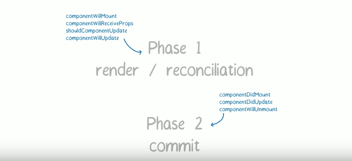

# React Fiber

## React Fiber是什么

使用React的同学们都应该要知道React Fiber，因为这玩意快要正式发布了。

React Fiber这个大改变Facebook已经折腾两年多了，刚刚结束不久的React Conf 2017会议上，Facebook终于确认，React Fiber会搭上React下一个大版本v16的顺风车发布。

在 [Is Fiber Ready Yet?](https://link.zhihu.com/?target=http%3A//isfiberreadyyet.com/) 这个网站上可以看到当前React Fiber的单元测试通过率，我刚刚（北京时间2017年3月28日下午1:41）看到的是93.6%，据说Facebook在自己的网站已经将React Fiber投入实战，所以，React Fiber大势所趋，是时候了解一下React Fiber了。


React Fiber是个什么东西呢？官方的一句话解释是“**React Fiber是对核心算法的一次重新实现”**。这么说似乎太虚无缥缈，所以还是要详细说一下。


首先，不用太紧张，不要以为React Fiber的到来是一场大革命，实际上，对我们只是把React当做工具的开发者来说，很可能感觉不到有什么功能变化。等到React v16发布的时候，我们修改package.json中的react版本号，重新npm install，一切就搞定了，然后我们就感觉到网页性能更高了一些，如此而已。

当然，上面说的是“理想情况”，React Fiber对算法的修改，还是会带来一些功能逻辑的变化，后面会说。

为什么Facebook要搞React Fiber呢？我们先要了解现在React（也就是直到目前最新的v15版本）的局限。

## 同步更新过程的局限

在现有React中，更新过程是同步的，这可能会导致性能问题。

当React决定要加载或者更新组件树时，会做很多事，比如调用各个组件的生命周期函数，计算和比对Virtual DOM，最后更新DOM树，这整个过程是同步进行的，也就是说只要一个加载或者更新过程开始，那React就以不破楼兰终不还的气概，一鼓作气运行到底，中途绝不停歇。

表面上看，这样的设计也是挺合理的，因为更新过程不会有任何I/O操作嘛，完全是CPU计算，所以无需异步操作，的确只要一路狂奔就行了，但是，当组件树比较庞大的时候，问题就来了。

假如更新一个组件需要1毫秒，如果有200个组件要更新，那就需要200毫秒，在这200毫秒的更新过程中，浏览器那个唯一的主线程都在专心运行更新操作，无暇去做任何其他的事情。想象一下，在这200毫秒内，用户往一个input元素中输入点什么，敲击键盘也不会获得响应，因为渲染输入按键结果也是浏览器主线程的工作，但是浏览器主线程被React占着呢，抽不出空，最后的结果就是用户敲了按键看不到反应，等React更新过程结束之后，咔咔咔那些按键一下子出现在input元素里了。

这就是所谓的界面卡顿，很不好的用户体验。

现有的React版本，当组件树很大的时候就会出现这种问题，因为更新过程是同步地一层组件套一层组件，逐渐深入的过程，在更新完所有组件之前不停止，函数的调用栈就像下图这样，调用得很深，而且很长时间不会返回。


因为JavaScript单线程的特点，每个同步任务不能耗时太长，不然就会让程序不会对其他输入作出相应，React的更新过程就是犯了这个禁忌，而React Fiber就是要改变现状。

## React Fiber的方式

破解JavaScript中同步操作时间过长的方法其实很简单——分片。

把一个耗时长的任务分成很多小片，每一个小片的运行时间很短，虽然总时间依然很长，但是在每个小片执行完之后，都给其他任务一个执行的机会，这样唯一的线程就不会被独占，其他任务依然有运行的机会。

React Fiber把更新过程碎片化，执行过程如下面的图所示，每执行完一段更新过程，就把控制权交还给React负责任务协调的模块，看看有没有其他紧急任务要做，如果没有就继续去更新，如果有紧急任务，那就去做紧急任务。

维护每一个分片的数据结构，就是Fiber。

有了分片之后，更新过程的调用栈如下图所示，中间每一个波谷代表深入某个分片的执行过程，每个波峰就是一个分片执行结束交还控制权的时机。


道理很简单，但是React实现这一点却不容易，要不然怎么折腾了两年多！

对具体数据结构原理感兴趣的同学可以去看[Lin Clark在React Conf 2017上的演讲](https://link.zhihu.com/?target=https%3A//www.youtube.com/watch%3Fv%3DZCuYPiUIONs) （要翻墙的），本文中的介绍图片也出自这个演讲。


## 为什么叫Fiber呢？

大家应该都清楚进程（Process）和线程（Thread）的概念，在计算机科学中还有一个概念叫做Fiber，英文含义就是“纤维”，意指比Thread更细的线，也就是比线程(Thread)控制得更精密的并发处理机制。

上面说的Fiber和React Fiber不是相同的概念，但是，我相信，React团队把这个功能命名为Fiber，含义也是更加紧密的处理机制，比Thread更细。

说个题外话，很多年前，我听一个前辈讲课，他说到Fiber这么一回事，我就问他：怎么让我的程序进入可以操控Fiber的状态？前辈的回答是：你的程序真的需要用到Fiber吗？如果现在的方法就能满足需求，根本就不需要知道Fiber是什么东西。

呵呵，前辈说的当时我还不大理解，后来越来越觉得前辈说得有道理，如果根本没有必要用上一样东西，那就不用也罢，不要因为那个东西酷就去用，不然很可能就是自找苦吃。

扯远了，我想说的是，其实对大部分React使用者来说，也不用深究React Fiber是如何实现的，除非实现方式真的对我们的使用方式有影响，我们也不用要学会包子怎么做的才吃包子对不对？

但是，React Fiber的实现改变还真的让我们的代码方式要做一些调整。

## React Fiber对现有代码的影响

理想情况下，React Fiber应该完全不影响现有代码，但可惜并完全是这样，要吃这个包子还真要知道一点这个包子怎么做的，你如果不喜欢吃甜的就不要吃糖包子，对不对？

在React Fiber中，一次更新过程会分成多个分片完成，所以完全有可能一个更新任务还没有完成，就被另一个更高优先级的更新过程打断，这时候，优先级高的更新任务会优先处理完，而低优先级更新任务所做的工作则会**完全作废，然后等待机会重头再来**。

因为一个更新过程可能被打断，所以React Fiber一个更新过程被分为两个阶段(Phase)：第一个阶段Reconciliation Phase和第二阶段Commit Phase。

在第一阶段Reconciliation Phase，React Fiber会找出需要更新哪些DOM，这个阶段是可以被打断的；但是到了第二阶段Commit Phase，那就一鼓作气把DOM更新完，绝不会被打断。

这两个阶段大部分工作都是React Fiber做，和我们相关的也就是生命周期函数。

以render函数为界，第一阶段可能会调用下面这些生命周期函数，说是“可能会调用”是因为不同生命周期调用的函数不同。

- componentWillMount
- componentWillReceiveProps
- shouldComponentUpdate
- componentWillUpdate


下面这些生命周期函数则会在第二阶段调用。

- componentDidMount
- componentDidUpdate
- componentWillUnmount




因为第一阶段的过程会被打断而且“重头再来”，就会造成意想不到的情况。

比如说，一个低优先级的任务A正在执行，已经调用了某个组件的componentWillUpdate函数，接下来发现自己的时间分片已经用完了，于是冒出水面，看看有没有紧急任务，哎呀，真的有一个紧急任务B，接下来React Fiber就会去执行这个紧急任务B，任务A虽然进行了一半，但是没办法，只能完全放弃，等到任务B全搞定之后，任务A重头来一遍，注意，是重头来一遍，不是从刚才中段的部分开始，也就是说，componentWillUpdate函数会被再调用一次。

在现有的React中，每个生命周期函数在一个加载或者更新过程中绝对只会被调用一次；**在React Fiber中，不再是这样了，第一阶段中的生命周期函数在一次加载和更新过程中可能会被多次调用！**

使用React Fiber之后，一定要检查一下第一阶段相关的这些生命周期函数，看看有没有逻辑是假设在一个更新过程中只调用一次，有的话就要改了。

我们挨个看一看这些可能被重复调用的函数。

componentWillReceiveProps，即使当前组件不更新，只要父组件更新也会引发这个函数被调用，所以多调用几次没啥，通过！


shouldComponentUpdate，这函数的作用就是返回一个true或者false，不应该有任何副作用，多调用几次也无妨，通过！

render，应该是纯函数，多调用几次无妨，通过！

只剩下componentWillMount和componentWillUpdate这两个函数往往包含副作用，所以当使用React Fiber的时候一定要重点看这两个函数的实现。

## 怎么试用React Fiber?

虽然React Fiber还没有正式发布，现在你就可以试用React Fiber，用这种方式安装react和react-dom

```text
yarn add react@next react-dom@next
```

我试着将现有项目的React替换成React Fiber之后，代码没有任何改变，可以正常运行，说明我的应用里生命周期函数应该没有假设只会被调用一次。

我相信当React Fiber正式发布的时候，会有更清晰详尽的文档，到时候我们再来详细介绍。

欢迎关注这个专栏 [进击的React - 知乎专栏](https://zhuanlan.zhihu.com/advancing-react)

**更新**：我开了一个Live专门介绍Fibeer《[深入理解React v16新功能](https://www.zhihu.com/lives/896398188230103040)》

编辑于 2017-10-24