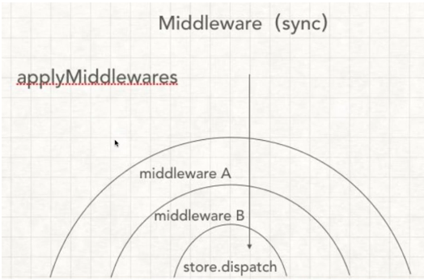

# [【React进阶系列】redux api](https://segmentfault.com/a/1190000016726553)

简介： 实现redux基础api

## createStore( )和store相关方法

**api回顾：**

**createStore(reducer, [preloadedState], enhancer)**

```js
创建一个 Redux store 来以存放应用中所有的 state
reducer (Function): 接收两个参数，当前的 state 树/要处理的 action，返回新的 state 树
preloadedState: 初始时的 state
enhancer (Function): store creator 的高阶函数，返回一个新的强化过的 store creator
```

**Store 方法**

```
getState() 返回应用当前的 state 树
dispatch(action) 分发 action。这是触发 state 变化的惟一途径
subscribe(listener) 添加一个变化监听器。每当 dispatch action 的时候就会执行，state 树中的一部分可能已经变化
replaceReducer(nextReducer) 替换 store 当前用来计算 state 的 reducer（高级不常用，不作实现）实现 Redux 热加载机制会用到
```


源码实现：

```js
./self-redux.js

export function createStore(reducer, enhancer) {
  if(enhancer) {
     return enhancer(createStore)(reducer)
  }
  let currentState = {}
  let currentListeners = []
  function getState() {
    return currentState
  }
  function subscribe(listeners) {
    currentListeners.push(listener)
  }
  function dispatch(action) {
    currentState = reducer(currentState, action)
    currentListeners.forEach(v => v())
    return action
  }
  dispatch({ type: '@rainie/init-store' })
  return {
    getState,
    subscribe,
    dispatch
  }
}
```

demo:验证正确性

```js
// import { createStore } from 'redux'
// 将redux文件替换成自己实现的redux文件
   import { createStore } from './self-redux.js'

// 这就是reducer处理函数，参数是状态和新的action
function counter(state=0, action) {
  // let state = state||0
  switch (action.type) {
    case '加机关枪':
      return state + 1
    case '减机关枪':
      return state - 1
    default:
      return 10
  }
}
// 新建store
const store = createStore(counter)
const init = store.getState()
console.log(`一开始有机枪${init}把`)
function listener(){
  const current = store.getState()
  console.log(`现在有机枪${current}把`)
}
// 订阅，每次state修改，都会执行listener
store.subscribe(listener)
// 提交状态变更的申请
store.dispatch({ type: '加机关枪' })
```

## combineReducers(reducers)

**api简介**

```js
把一个由多个不同 reducer 函数作为 value 的 object，合并成一个最终的 reducer 函数
实现 Redux 热加载机制会用到
import { combineReducers } from 'redux'
import todos from './todos'
import counter from './counter'

export default combineReducers({
  todos,
  counter
})
```

**实现：**

实质就是返回一个大的function 接受state，action，然后根据key用不同的reducer
注：combinedReducer的key跟state的key一样

```js
const reducer = combineReducers({
  a: doSomethingWithA,
  b: processB,
  c: c
})
function reducer(state = {}, action) {
  return {
    a: doSomethingWithA(state.a, action),
    b: processB(state.b, action),
    c: c(state.c, action)
  }
}
function combindReducer(reducers) {
    // 第一个只是先过滤一遍 把非function的reducer过滤掉
  const reducerKeys = Object.keys(reducers)
  const finalReducers = {}
  reducerKeys.forEach((key) => {
      if(typeof reducers[key] === 'function') {
      finalReducers[key] = reducers[key]
      } 
  })
  const finalReducersKeys = Object.keys(finalReducers)
    // 第二步比较重要 就是将所有reducer合在一起
    // 根据key调用每个reducer，将他们的值合并在一起
    let hasChange = false;
    const nextState = {};
    return function combind(state={}, action) {
        finalReducersKeys.forEach((key) => {
            const previousValue = state[key];
            const nextValue = reducers[key](previousValue, action);
            nextState[key] = nextValue;
            hasChange = hasChange || previousValue !== nextValue
        })
        return hasChange ? nextState : state;
    }
}
```

**applyMiddleware(...middleware)**

使用包含自定义功能的 middleware 来扩展 Redux 是
...middleware (arguments): 遵循 Redux middleware API 的函数。
每个 middleware 接受 Store 的 dispatch 和 getState 函数作为命名参数，并返回一个函数。
该函数会被传入 被称为 next 的下一个 middleware 的 dispatch 方法，并返回一个接收 action 的新函数，这个函数可以直接调用 next(action)，或者在其他需要的时刻调用，甚至根本不去调用它。
调用链中最后一个 middleware 会接受真实的 store 的 dispatch 方法作为 next 参数，并借此结束调用链。
所以，middleware 的函数签名是 ({ getState, dispatch }) => next => action

```jsx
import { createStore, combineReducers, applyMiddleware } from 'redux'
import thunk from 'redux-thunk'
import * as reducers from './reducers'

let reducer = combineReducers(reducers)
// applyMiddleware 为 createStore 注入了 middleware:
let store = createStore(reducer, applyMiddleware(thunk))
```

## 中间件机制applyMiddleware的实现

中间件机制图



实现步骤
1.扩展createStore,使其接受第二个参数（中间件其实就是对createStore方法的一次扩展）
2.实现applyMiddleware,对store的disptach进行处理
3.实现一个中间件

正常调用

```jsx
import React from 'react'
import ReactDOM from 'react-dom'
// import { createStore, applyMiddleware} from 'redux'
import { createStore, applyMiddleware} from './self-redux'
// import thunk from 'redux-thunk'
import thunk from './self-redux-thunk'
import { counter } from './index.redux'
import { Provider } from './self-react-redux';
import App from './App'
 
const store = createStore(counter, applyMiddleware(thunk))
ReactDOM.render(
  (
    <Provider store={store}>
      <App />
    </Provider>
  ),
  document.getElementById('root')) 
// 便于理解：函数柯利化例子
function add(x) {
  return function(y) {
    return x+y
  }
}
add(1)(2) //3
```

applymiddleware

```js
// ehancer(createStore)(reducer)
// createStore(counter, applyMiddleware(thunk))
// applyMiddleware(thunk)(createStore)(reducer)
// 写法函数柯利化
export function applyMiddleware(middleware) {
  return function (createStore) {
    return function(...args) {
      // ...
    }
  }
}


// 只处理一个 middleware 时
export function applyMiddleware(middleware) {
   return createStore => (...args) => {
     const store = createStore(...args)
     let dispatch = store.dispatch

     const midApi = {
       getState: store.getState,
       dispatch: (...args) => dispatch(...args)
     }
    // 经过中间件处理，返回新的dispatch覆盖旧的
     dispatch = middleware(midApi)(store.dispatch)
    // 正常中间件调用：middleware(midApi)(store.dispatch)(action)

    return {
      ...store,
      dispatch
    }
   }
 }

// 处理多个middleware时

//  多个 compose
 export function applyMiddleware(...middlewares) {
   return createStore => (...args) => {
     const store = createStore(...args)
     let dispatch = store.dispatch

     const midApi = {
       getState: store.getState,
       dispatch: (...args) => dispatch(...args)
     }

    const middlewareChain = middlewares.map(middleware => middleware(midApi))
    dispatch => compose(...middlewareChain(store.dispatch))
    //  dispatch = middleware(midApi)(store.dispatch)
    // middleware(midApi)(store.dispatch)(action)

    return {
      ...store,
      dispatch
    }
   }
 }
```

手写redux-thunk异步中间件实现

```js
// middleware(midApi)(store.dispatch)(action)
const thunk = ({ dispatch, getState }) => next => action => {
  // next就是store.dispatch函数
  // 如果是函数，执行以下，参数dispatch和getState
  if (typeof action == 'function') {
    return action(dispatch, getState)
  }
  // 默认 什么都不干
  return next(action)
}
export default thunk

// 处理异步action
export function addGunAsync() {
  // thunk插件作用，这里可以返回函数
  return dispatch => {
    setTimeout(() => {
      // 异步结束后，手动执行dispatch
      dispatch(addGun())
    }, 2000)
  }
}
```

趁热打铁，再实现一个中间件: dispatch接受一个数组，一次处理多个action

```js
export arrayThunk = ({ dispatch, getState }) => next => action => {
  if(Array.isArray(action)) {
    return action.forEach(v => dispatch(v))
  }

  return next(action)
}

// 这类action会被处理
export function addTimes() {
  return [{ type: ADD_GUN },{ type: ADD_GUN },{ type: ADD_GUN }]
}
```

## bindActionCreators的实现

在react-redux connect mapDispatchToProps中使用到了该方法，可以去看那篇blog,有详解~

**api: bindActionCreators(actionCreators, dispatch)**


把 action creators 转成拥有同名 keys 的对象，但使用 dispatch 把每个 action creator 包围起来，这样可以直接调用它们

**实现：**

```js
 function bindActionCreator(creator, dispatch) {
   return (...args) => dispatch(creator(...args))
 }

 export function bindActionCreators(creators, dispatch) {
   let bound = {}
   Object.keys(creators).forEach( v => {
     let creator = creators[v]
     bound[v] = bindActionCreator(creator, dispatch)
   })
   return bound
 }
//  简写
 export function bindActionCreators(creators, dispatch) {
  return Object.keys(creators).reduce((ret, item) => {
     ret[item] =  bindActionCreator(creators[item], dispatch)
     return ret
   }, {})
 }
```

## compose的实现

**api: compose(...functions)**


> 从右到左来组合多个函数。当需要把多个 store 增强器 依次执行的时候，需要用到它。
```js
import { createStore, applyMiddleware, compose } from 'redux'
import thunk from 'redux-thunk'
import DevTools from './containers/DevTools'
import reducer from '../reducers'

const store = createStore(
  reducer,
  compose(
    applyMiddleware(thunk),
    DevTools.instrument()
  )
)
```

**实现：**
compose(fn1, fn2, fn3)
fn1(fn2(fn3))

```js
 export function compose(...funcs) {
   if(funcs.length == 0) {
     return arg => arg
   }
   if(funcs.length == 1) {
     return funcs[0]
   }
   return funcs.reduce((ret,item) => (...args) => ret(item(...args)))
 }
```