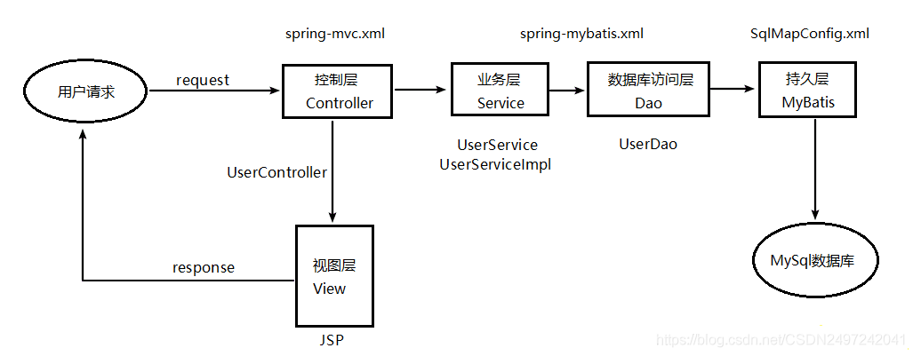

# Java SSM框架简介

前言：在学习Java SSM框架前，我提前学习了反射、注解和MVC模式，因为它们频繁在SSM框架中被用到，建议大家先弄明白了这些基础知识，再学习SSM框架就很简单了。

Java进阶知识1：反射机制

Java进阶知识2：注解

MVC模式的正确理解

一、Java SSM框架的概念
Java SSM框架即指Spring+SpringMVC+MyBatis的简称，框架集由Spring、MyBatis两个开源框架整合而成（SpringMVC是Spring中的部分内容）,常作为数据源较简单的web项目的框架。

相比于之前的SSH（Spring+Struts+Hibernate），SSM更加轻量化和灵活，是目前业界主流的Java Web开发框架。

当前2019年10月15日，Spring的最新版本为：5.2.0,而MyBatis最新版本为：3.5.2

(1)Spring

    Spring是一个开源框架，Spring是于2003 年兴起的一个轻量级的Java开发框架，由Rod Johnson 在其著作Expert One-On-One J2EE Development and Design中阐述的部分理念和原型衍生而来。它是为了解决企业应用开发的复杂性而创建的。Spring使用基本的JavaBean来完成以前只可能由EJB完成的事情。然而，Spring的用途不仅限于服务器端的开发。从简单性、可测试性和松耦合的角度而言，任何Java应用都可以从Spring中受益。 简单来说，Spring是一个轻量级的控制反转（IoC）和面向切面（AOP）的容器框架。
    
     Spring就像是整个项目中装配JavaBean的大工厂，在配置文件中可以指定使用特定的参数去调用实体类的构造方法来实例化对象。也可以称之为项目中的粘合剂。Spring的核心思想是IoC（控制反转），即不再需要程序员去显式地new一个对象，而是让Spring框架帮你来完成这一切；而重要功能Aop（面向切面编程）能够将那些与业务无关，却为业务模块所共同调用的逻辑或责任（例如事务处理、日志管理、权限控制等）封装起来，在系统的业务流程代码中需要的位置切入这些通用功能代码，以便于减少系统的重复代码，有利于项目未来的可拓展性和可维护性。

(2)SpringMVC

      Spring MVC属于SpringFrameWork的后续产品，已经融合在Spring Web Flow里面。SpringMVC把传统的模型层被拆分为了业务层(Service)和数据访问层（DAO,Data Access Object）。在业务层中可以通过 Spring 的声明式事务操作数据访问层，而在业务层上还允许我们访问 NoSQL ，这样就能够满足异军突起的 NoSQL 的使用了，它可以大大提高互联网系统的性能。
    
     SpringMVC在项目中拦截用户请求，它的核心Servlet即DispatcherServlet承担中介或是前台这样的职责，将用户请求通过HandlerMapping去匹配Controller，Controller就是具体对应请求所执行的操作，最终把Model层执行结果返回给用户。SpringMVC相当于SSH框架中struts。

(3)MyBatis

 MyBatis 本是apache的一个开源项目iBatis, 2010年这个项目由apache software foundation 迁移到了google code，并且改名为MyBatis ，2013年11月迁移到Github。MyBatis 是一款优秀的Java持久层框架，它支持定制化 SQL、存储过程以及高级映射。MyBatis 消除了几乎所有的JDBC代码和参数的手工设置以及结果集的检索。MyBatis 使用简单的 XML配置文件或注解，将接口和 Java 的POJOs（Plain Old Java Objects，普通的 Java对象）映射成数据库中的记录。

    MyBatis是对JDBC的封装，它让数据库底层操作变的透明，属于半自动的ORM(对象关系映射)框架。mybatis的操作都是围绕一个sqlSessionFactory实例展开的。mybatis通过配置文件关联到各实体类的Mapper文件，Mapper文件中配置了每个类对数据库所需进行的sql语句映射。在每次与数据库交互时，通过sqlSessionFactory拿到一个sqlSession，再执行sql命令。

Mybatis是半自动ORM映射工具，可以自定义高效的SQL语句提升数据库访问的效率。Mybatis是半自动的原因是因为我们要在Mapper文件中手写SQL语句，全自动的ORM（如Hibernate）是不需要手写SQL的。MyBatis可以自定义高效的SQL语句提升数据库访问的效率；而且MyBatis容易掌握，而Hibernate门槛较高。所以我们用Mybatis代替传统的Hibernate。

二、Java SSM框架的用处
我们在实际应用中发现，SpringMVC可以完全替代Struts，配合注解的方式，编程非常快捷，而且通过restful风格定义url，让地址看起来非常优雅。另外，MyBatis也可以替换Hibernate，正因为MyBatis的半自动特点，我们程序猿可以完全掌控SQL，这会让有数据库经验的程序猿能开发出高效率的SQL语句，而且XML配置管理起来也非常方便。

我们先了解一下这三个框架分别是干什么的？相信大以前也看过不少这些概念，这里就用大白话来讲：

   SpringMVC：它用于web层，相当于controller（等价于传统的servlet和struts的action），用来处理用户请求。举个例子，用户在地址栏输入http://网站域名/login，那么springmvc就会拦截到这个请求，并且调用controller层中相应的方法，（中间可能包含验证用户名和密码的业务逻辑，以及查询数据库操作，但这些都不是springmvc的职责），最终把结果返回给用户，并且返回相应的页面（当然也可以只返回json/xml等格式数据）。springmvc就是做前面和后面过程的活，与用户打交道！！

    Spring：太强大了，以至于我无法用一个词或一句话来概括它。但与我们平时开发接触最多的估计就是IOC容器，它可以装载bean（也就是我们java中的类，当然也包括service dao里面的），有了这个机制，我们就不用在每次使用这个类的时候为它初始化，很少看到关键字new。另外spring的aop，事务管理等等都是我们经常用到的。
    
    MyBatis：如果你问我它跟鼎鼎大名的Hibernate有什么区别？我只想说，他更符合我的需求。第一，它能自由控制sql，这会让有数据库经验的人编写的代码能搞提升数据库访问的效率。第二，它可以使用xml的方式来组织管理我们的sql，因为一般程序出错很多情况下是sql出错，别人接手代码后能快速找到出错地方，甚至可以优化原来写的sql。

为了更加能理解 SSM 处理用户请求的整个过程，下面给出一张 SSM 系统架构图：

 

三、SSM框架学习路线
SSM框架自学(一)——Spring学习总结

SSM框架自学(二)——Spring MVC学习总结

SSM框架自学(三)——Mybatis学习总结

SSM框架自学(四)——Maven项目管理工具快速入门

SSM框架自学(五)——Maven构建SSM项目快速入门

SSM框架自学(六)——Log4j日志系统工具使用总结

SSM框架自学(七)——Junit单元测试工具使用总结

SSM框架自学(八)——SpringMVC如何返回JSON格式的数据

SSM框架自学(九)——Spring使用注解代替复杂的XML配置文件

SSM框架高频率面试题（含答案）
------------------------------------------------
版权声明：本文为CSDN博主「Java后端何哥」的原创文章，遵循CC 4.0 BY-SA版权协议，转载请附上原文出处链接及本声明。
原文链接：https://blog.csdn.net/CSDN2497242041/article/details/102023839